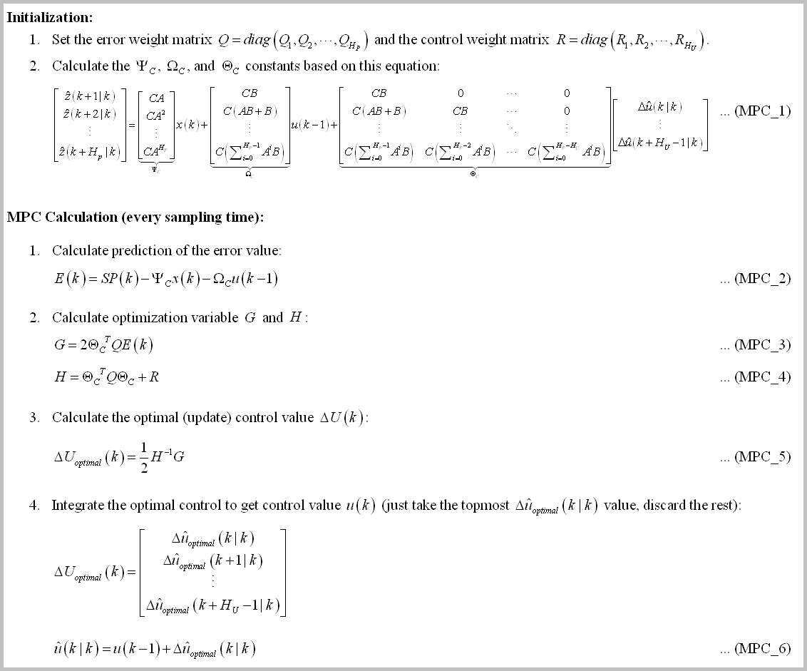
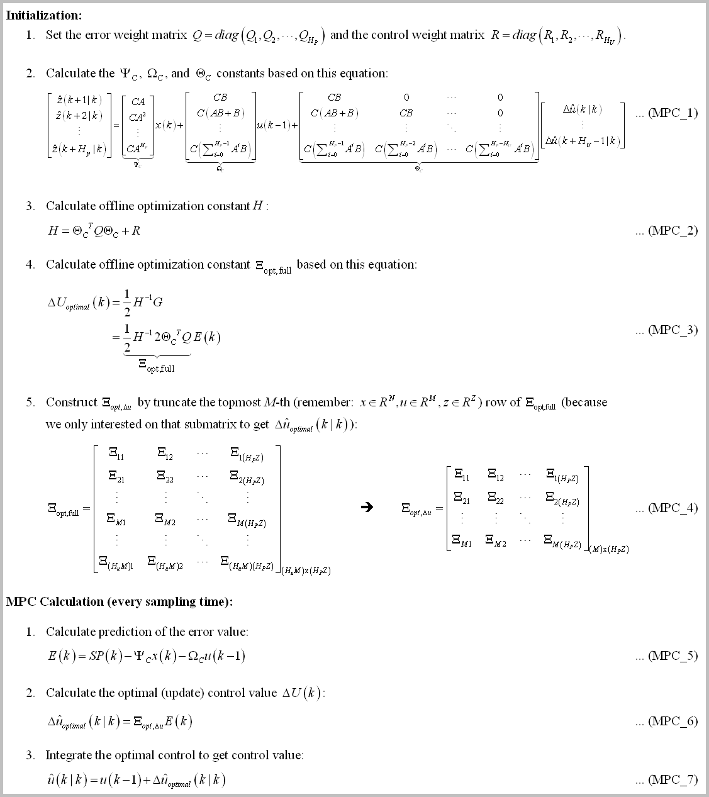
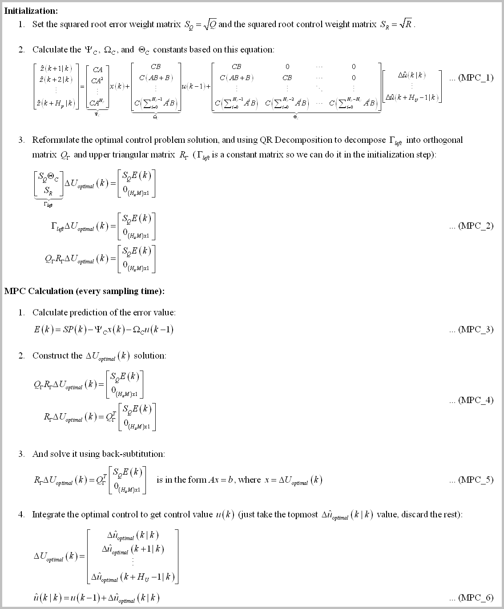
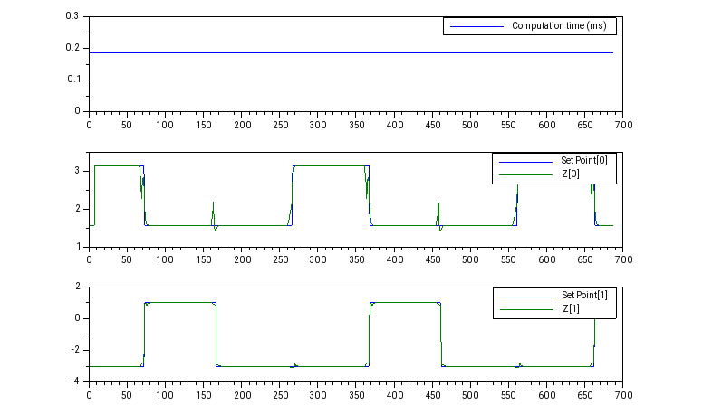
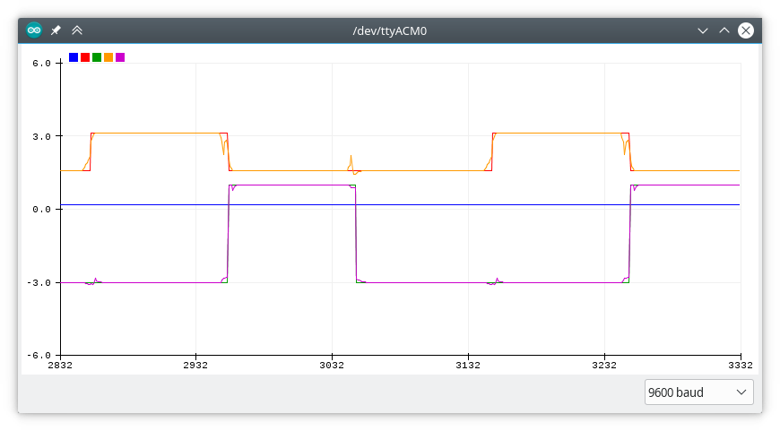

# Arduino_MPC_Library
This is a compact (unconstrained) Model Predictive Control (MPC) library for Teensy4.0/Arduino system (or real time embedded system in general).
- It's not using Eigen (small source code).
- It's not using C++ Standard Library/std (for embedded consideration).
- If you set `SISTEM_IMPLEMENTASI` to `SISTEM_EMBEDDED_NO_PRINT` in `konfig.h`, the code is platform agnostic (not using any library beside these C header files: `stdlib.h`, `stdint.h`, and `math.h`).
- There's no malloc/new/free dynamic memory allocation for real time application (but using heavy stack local variables, so you need to run it through static memory analyzer if you are really concern about hard real time application).

# The Background
I believe the concept and mathematics of (linear) MPC should be attainable from the undergraduate control system engineering student's level of mathematical sophistication. With that in mind, I made a compact MPC library (without dependence on big library like Eigen) where the main goal is for the student to learn the MPC concept (I've made decision to sacrifice speed to get best code readability I could get) while still capable of tackling real-time control system implementation (the code is computed in **~100 us**! See *Some Benchmark* section below).

The MPC formula derivation can be described as (I'm using Jan Maciejowski's *Predictive Control with Constraints* as reference, great book btw) :

# The Implementations
The implementations of the MPC control calculation consist of three main implementations, each of the implementation is self contained and calculate the same (control) output. The differences between them are in the readability, the speed, and the numerical robustness of the control algorithm. If you are still learning about MPC, I suggest you to read them all to understand the mathematics behind them.

The implementations are (from the simplest to the most advanced):
1. Naive Implementation ([mpc_engl](mpc_engl)). **Use this if you want to understand MPC (by reading the code) for the first time.**
2. Optimized version of the Naive Implementation ([mpc_opt_engl](mpc_opt_engl)). **Use this if you want the fastest implementation.**
3. The numerically robust version ([mpc_least_square_engl](mpc_least_square_engl)). **Use this if you want the most robust implementation.**

The MPC code are spread over just 4 files (`mpc.cpp, mpc.h, matrix.h, konfig.h`) - read *How to Use* section below for more explanation.

## The first implementation description: The Naive Implementation
The Naive Implementation algorithm is just a direct implementation of the MPC derivation above. The MPC algorithm can be described as (the source code can be found in "[mpc_engl](mpc_engl)" folder):

Note that the `H` matrix and (some of calculation inside) `G` matrix are actually constant. So we should be able to move them into Initialization step (just calculate once).

## The second implementation description: Optimized version of the Naive Implementation
The optimized version is exploiting 2 facts of The Naive Implementation:
1. The `H` matrix and (some of calculation inside) `G` matrix (specifically the `2 * THETA' * Q` portion) are actually constant.
2. The equation `du(k) = 1/2 * H^-1 * G` can be described as `du(k) = 1/2 * H^-1 * (2 * THETA' * Q) * E(k)`. And actually we don't need all row of the (constant) matrix `[1/2 * H^-1 * (2 * THETA' * Q)]` (because we only interested on the first M-th row to calculate `du(k)`).

So we can move the optimization matrix constant into initialization stage and truncate the optimization matrix to shorten the calculation time. The MPC algorithm then can be described as (the source code can be found in "[mpc_opt_engl](mpc_opt_engl)" folder):

## The third implementation description: The Numerically Robust Version
From the numerical analysis point of view, the first & second implementation is bad because of 2 facts:
1. Inverting the `H` matrix (using Gauss-Jordan like in above implementation) is bad.
We need to change the inversion operation using mathematically equivalent operation (I use QR decomposition here).
2. The `THETA` matrix is often ill conditioned, so the `((CTHETA') * Q * CTHETA)` calculation is bad.
This statement stem from the fact that [squaring matrix with itself will increase its condition number](https://math.stackexchange.com/questions/1351616/condition-number-of-ata), where [the bigger condition number of a matrix is, the more ill conditioned it is](https://en.wikipedia.org/wiki/Condition_number). We can avoid the `((CTHETA') * Q * CTHETA)` by reformulate the optimal control problem as a least-squares problem (you can refer to MPC textbook for full explanation).

The MPC algorithm then can be described as (the source code can be found in "[mpc_least_square_engl](mpc_least_square_engl)"):

(I'm using householder transformation to calculate the QR decomposition).

# How to Use
Just place one of the implementation folder ("[mpc\_engl](mpc_engl)", "[mpc_opt_engl](mpc_opt_engl)", or "[mpc_least_square_engl](mpc_least_square_engl)") in your Arduino installation folder and run with it! Don't forget to turn on Arduino Plotter for real-time plotting.

The system configuration can be customized in `konfig.h`, where you can play around with parameters like `Hp (Prediction Horizon)` or `Hu (Control Horizon)`, the length of `X, U, Z vector`, etc. The example to use the code and the LTI system definition can be read at mpc*.ino file.

The MPC code itself is self contained and spread over just 4 files (`mpc.cpp, mpc.h, matrix.h, konfig.h`), so you shouldn't have difficulty at understanding the code. You just need to construct the MPC class, initialize it with function `MPC::vReInit(A, B, C, weightQ, weightR)` (where the `A, B, C` is the LTI matrix and the `weightQ, weightR` is the diagonal value of the MPC weight matrix Q and R) and call the function `MPC::bUpdate(SP, X, U)` at every sampling time to calculate the control value `U(k)`.

- For Arduino configuration (`#define SISTEM_IMPLEMENTASI     SISTEM_EMBEDDED_ARDUINO` in `konfig.h`):
The code is tested on compiler Arduino IDE 1.8.10 and hardware Teensy 4.0 Platform.
- For PC configuration (`#define SISTEM_IMPLEMENTASI     SISTEM_PC` in `konfig.h`):
The code is tested on compiler Qt Creator 4.8.2 and hardware typical PC Platform.

**Important note: For Teensy 4.0, I encounter RAM limitation where the `MATRIX_MAXIMUM_SIZE` can't be more than 28 (if you are using double precision) or 40 (if using single precision). If you already set more than that, your Teensy might be unable to be programmed (a bug in the Teensy bootloader?). The solution is simply to change the `MATRIX_MAXIMUM_SIZE` to be less than that, compile & upload the code from the compiler (the IDE then will protest that it cannot find the Teensy board), and click the program button on the Teensy board to force the bootloader to restart and download the firmware from the computer.**

# Some Benchmark

To demonstrate the code, I've made the MPC control a state-space model (HIL style) for Jet Transport Aircraft (ref: https://www.mathworks.com/help/control/ug/mimo-state-space-models.html#buv3tp8-1), where the configuration is (4 state, 2 input, 2 output LTI system) + Hp=7 & Hu=4. The compiler is Arduino IDE 1.8.10 with default setting (compiler optimization setting: faster) and the hardware is Teensy 4.0.

The computation time needed to compute one iteration of `MPC::bUpdate(SP, X, U)` function are (*drum-roll*):
1. Naive implementation (in "[mpc_engl](mpc_engl)" folder): **187 us** to compute one iteration (single precision math) or **312 us** (double precision).
2. Optimized version of the naive implementation (in "[mpc_opt_engl](mpc_opt_engl)"): **31 us** to compute one iteration (single precision math) or **59 us** (double precision).
3. The numerically robust version (in "[mpc_least_square_engl](mpc_least_square_engl)"): **101 us** to compute one iteration (single precision math) or **184 us** (double precision).

(Teensy 4.0 is wicked fast!)

The result, plotted using Scilab (you can see moving-the-output-before-the-set-point-changed characteristic unique to MPC, and the input coupling reduction mechanism):

Or if you don't want to install Scilab, you can use Arduino's Serial Plotter (with limited capability):

# Closing Remark

Maybe in the future I'll implement support for constrained MPC using Quadratic Programming solver (or even Mixed Integer QuadProg!). In the meantime, it will be nice if you can test & validate my result or inform me if there are some bugs you encounter along the way! (or if you notice some grammar error in the documentation).

The matrix.h library's code documentation is still in Indonesian, and I plan to translate it into English soon (stay tuned!).

I published the code under CC0 license, effectively placed the code on public domain. But it will be great if you can tell me if you use the code, for what/why. That means a lot to me and give me motivation to expand the work (⌒▽⌒)

*This tutorial is adopted from Reddit post: https://reddit.com/r/ControlTheory/comments/efikg6/unconstrained_mpc_library_for_arduino_and_some/*

